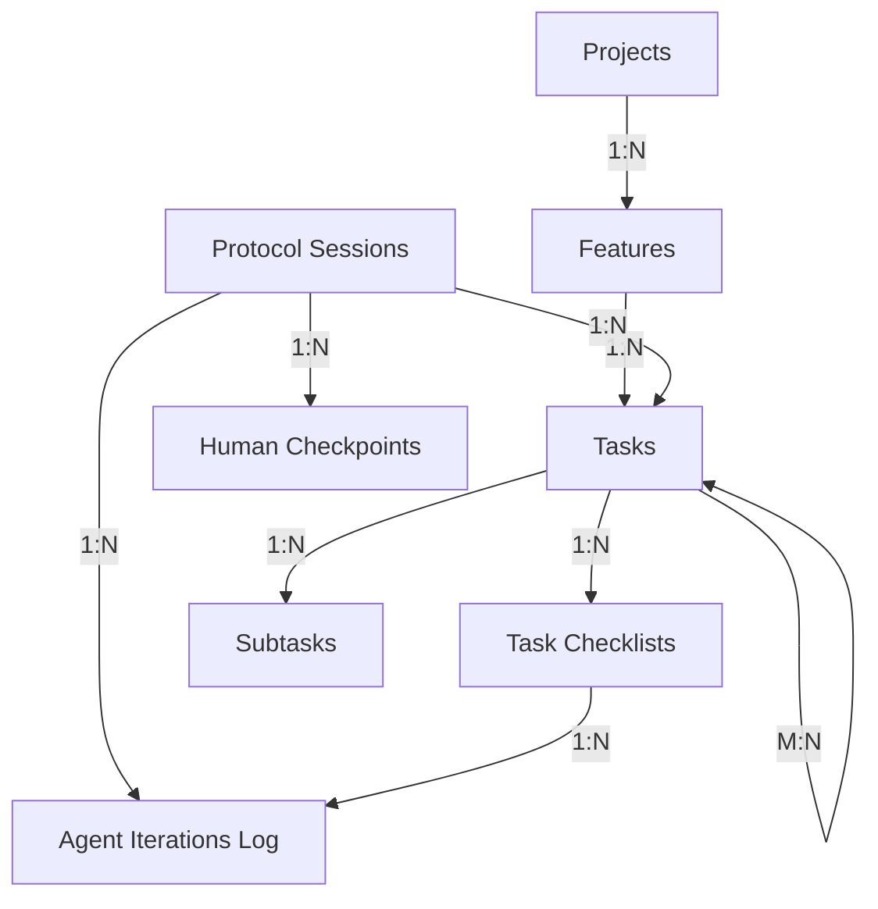

# Social Pixl Project Management System
## Master Documentation Index

**Last Updated**: 2026-01-18  
**Status**: Complete - Ready for Implementation  
**System**: Social Pixl (NocoDB) as Single Source of Truth

---

## 📚 Documentation Overview

This is your complete guide to implementing Social Pixl as the canonical project management system for all development work, integrated with the modular agent protocol system.

---

## 📖 Core Documents

### 1. **Schema Design** (`social-pixl-schema.md`)
**Purpose**: Complete database schema specification  
**Contains**:
- All table definitions with fields and types
- Relationships and links between tables
- Data flow diagrams
- Sample queries
- Metrics and reporting structure

**Read this**: To understand the complete data model

---

### 2. **Implementation Guide** (`social-pixl-implementation-guide.md`)
**Purpose**: Step-by-step setup instructions  
**Contains**:
- Phase-by-phase implementation steps
- Detailed field creation instructions
- Screenshots and UI guidance
- Troubleshooting tips
- Post-setup configuration

**Read this**: When you're ready to create the tables in NocoDB UI

**Time Required**: 2-3 hours for complete setup

---

### 3. **Quick Start Template** (`social-pixl-quickstart-template.md`)
**Purpose**: Sample data for testing your setup  
**Contains**:
- Sample project (NocoDB Development)
- Sample features (Agent Protocol, Auth, Collaboration)
- Sample tasks with realistic details
- Sample protocol sessions
- Sample checklists and checkpoints
- Sample MCP registry entries

**Read this**: After Phase 1 setup to populate with test data

---

### 4. **Protocol Rules** (`.cursor/rules/`)
**Purpose**: Agent protocol system specifications  
**Location**: `/Users/elijahwilliams/Documents/GitHub/nocodb/.cursor/rules/`

**Files to Create**:
- `09-protocol-system.mdc` - Core protocol system
- `10-ralph-protocol.mdc` - Ralph Protocol spec
- `11-test-protocol.mdc` - Test Protocol spec
- `12-security-protocol.mdc` - Security Protocol spec
- `13-deploy-protocol.mdc` - Deploy Protocol spec
- `14-debug-protocol.mdc` - Debug Protocol spec
- `protocol-template.mdc` - Template for new protocols
- `20-social-pixl-table-ids.mdc` - Table ID reference (create after setup)

**Read this**: Protocol specifications from our earlier conversation

---

## 🎯 Implementation Roadmap

### Phase 1: Foundation (Week 1)
**Goal**: Basic project management structure

**Steps**:
1. ✅ Read schema design document
2. ✅ Follow implementation guide Phase 1
3. ✅ Enhance Projects table
4. ✅ Create Features table
5. ✅ Enhance Tasks table
6. ✅ Create Protocol Sessions table
7. ✅ Create Human Checkpoints table
8. ✅ Test with sample data from quick start template

**Deliverable**: Core tables ready, basic PM functionality working

---

### Phase 2: Ralph Protocol (Week 2)
**Goal**: Enable Ralph Protocol with full tracking

**Steps**:
1. ✅ Follow implementation guide Phase 2
2. ✅ Create Task Checklists table
3. ✅ Create Agent Iterations Log table
4. ✅ Add rollup fields to Features
5. ✅ Create protocol rule files in `.cursor/rules/`
6. ✅ Get table IDs using `getTablesList` MCP call
7. ✅ Create `20-social-pixl-table-ids.mdc` with actual IDs
8. ✅ Test Ralph Protocol with sample feature

**Deliverable**: Ralph Protocol fully functional with Social Pixl tracking

---

### Phase 3: Optimization (Week 3)
**Goal**: Polish and optimize the system

**Steps**:
1. ✅ Create MCP Registry table
2. ✅ Enhance Subtasks table
3. ✅ Create custom views and dashboards
4. ✅ Add remaining protocol specs (Test, Security, Deploy, etc.)
5. ✅ Document team workflows
6. ✅ Train team on system usage

**Deliverable**: Complete, production-ready PM system

---

## 🗂️ Table Structure Reference

### Core Tables (Phase 1)
```
Projects (Enhanced)
├── Id, Title, Description
├── Status, Priority
├── Repository Path, URL
├── Dates, Owner
└── Tech Stack, Environments

Features (New)
├── Id, Feature Name
├── Project (link)
├── Status, Priority, Complexity
├── Required MCPs
└── Success Criteria

Tasks (Enhanced)
├── Id, Title, Description
├── Feature (link)
├── Status, Task Type, Priority
├── Ralph Protocol fields
│   ├── Max Iterations
│   ├── Current Iteration
│   ├── Ralph Status
│   ├── Checklist Progress
│   └── Completion Promise
└── Timing and logging

Protocol Sessions (New)
├── Session ID
├── Protocol Name
├── Feature/Task links
├── Status, Scope
└── Metrics and outcomes

Human Checkpoints (New)
├── Protocol Session (link)
├── Checkpoint Type, Status
├── Agent Summary
├── Proposed Options
└── Human Decision
```

### Ralph Protocol Tables (Phase 2)
```
Task Checklists (New)
├── Task (link)
├── Step Number, Type, Name
├── Status, Attempts
└── Timing

Agent Iterations Log (New)
├── Protocol Session (link)
├── Task, Checklist Step (links)
├── Iteration Number
├── Action, Result
├── Error Message
└── Retry Strategy
```

### Optimization Tables (Phase 3)
```
MCP Registry (New)
├── MCP Name, Server Name
├── Category, Capabilities
├── Status
└── Protocol associations

Subtasks (Enhanced)
├── Task (link)
├── Description, Status
└── Timing
```

---

## 🔗 Key Relationships



---

## 📊 Social Pixl MCP Tools Reference

### Essential Operations

#### List Tables
```javascript
CallMcpTool: user-NocoDB Base - Social Pixl / getTablesList
{}
```

#### Get Schema
```javascript
CallMcpTool: user-NocoDB Base - Social Pixl / getTableSchema
{
  tableId: "table_id_here"
}
```

#### Query Records
```javascript
CallMcpTool: user-NocoDB Base - Social Pixl / queryRecords
{
  tableId: "table_id_here",
  where: "(Status,eq,Active)~and(Priority,eq,P0)",
  sort: [{ field: "Created At", description: "desc" }],
  pageSize: 50
}
```

#### Create Records
```javascript
CallMcpTool: user-NocoDB Base - Social Pixl / createRecords
{
  tableId: "table_id_here",
  records: [{
    fields: {
      Title: "New Record",
      Status: "Active",
      // ... more fields
    }
  }]
}
```

#### Update Records
```javascript
CallMcpTool: user-NocoDB Base - Social Pixl / updateRecords
{
  tableId: "table_id_here",
  records: [{
    id: "record_id_here",
    fields: {
      Status: "Completed",
      "Completed At": "2026-01-18T17:00:00Z"
    }
  }]
}
```

#### Delete Records
```javascript
CallMcpTool: user-NocoDB Base - Social Pixl / deleteRecords
{
  tableId: "table_id_here",
  recordIds: ["record_id_1", "record_id_2"]
}
```

---

## 🎮 Protocol System Integration

### How Agents Use Social Pixl

#### 1. Protocol Invocation
```
User: "Start Ralph Protocol on authentication feature"

Agent:
1. Queries Features table for "authentication"
2. Retrieves all linked Tasks
3. Generates checklist for each task
4. Creates Protocol Session record
5. Creates Task Checklists records
6. Executes Ralph loop
7. Logs every iteration to Agent Iterations Log
8. Updates Task and Checklist statuses in real-time
9. Creates Human Checkpoint when blocked
10. Updates Protocol Session on completion
```

#### 2. Progress Tracking
```
User: "What's the status of auth feature?"

Agent:
1. Queries Features table
2. Retrieves rollup: Tasks Completed / Tasks Total
3. Queries Task Checklists for active tasks
4. Shows current step, progress %, blockers
5. Reports from Social Pixl (single source of truth)
```

#### 3. Checkpoint Resolution
```
User: "Show me pending checkpoints"

Agent:
1. Queries Human Checkpoints table
2. Filter: Status = Pending
3. Displays each checkpoint with:
   - What's blocked
   - Agent's analysis
   - Proposed options
4. User provides decision
5. Agent updates checkpoint status
6. Agent resumes protocol
```

---

## 📈 Metrics & Reporting

### Project-Level Metrics
- **Total Features**: COUNT(Features WHERE Project = X)
- **Completed Features**: COUNT(Features WHERE Project = X AND Status = Completed)
- **Total Tasks**: SUM(Features.Tasks Count)
- **Completion %**: (Completed Tasks / Total Tasks) * 100
- **Average Task Time**: AVG(Tasks.Actual Time)
- **Blocker Count**: COUNT(Tasks WHERE Status = Blocked)

### Protocol-Level Metrics
- **Average Iterations**: AVG(Protocol Sessions.Iterations Used)
- **Success Rate**: (Completed / Total) * 100
- **Human Interventions**: AVG(Protocol Sessions.Human Interventions)
- **Most Used Protocol**: MODE(Protocol Sessions.Protocol Name)
- **Average Session Duration**: AVG(Protocol Sessions.Duration)

### Task-Level Metrics
- **Completion Rate**: (Done / Total) * 100
- **Average Checklist Steps**: AVG(Tasks.Checklist Total Steps)
- **Failure Rate**: (Failed / Total Attempts) * 100
- **Iteration Efficiency**: Completed / Iterations Used

---

## 🔍 Common Queries

### Get Active Protocol
```javascript
CallMcpTool: user-NocoDB Base - Social Pixl / queryRecords
{
  tableId: "[Protocol Sessions ID]",
  where: "(Status,eq,Active)",
  sort: [{ field: "Started At", description: "desc" }],
  pageSize: 1
}
```

### Get Blocked Tasks
```javascript
CallMcpTool: user-NocoDB Base - Social Pixl / queryRecords
{
  tableId: "[Tasks ID]",
  where: "(Status,eq,Blocked)",
  sort: [{ field: "Priority", description: "asc" }]
}
```

### Get Pending Checkpoints
```javascript
CallMcpTool: user-NocoDB Base - Social Pixl / queryRecords
{
  tableId: "[Human Checkpoints ID]",
  where: "(Status,eq,Pending)",
  sort: [{ field: "Created At", description: "asc" }]
}
```

### Get Task Progress
```javascript
CallMcpTool: user-NocoDB Base - Social Pixl / queryRecords
{
  tableId: "[Task Checklists ID]",
  where: "(Task,eq,task-004)",
  sort: [{ field: "Step Number", description: "asc" }]
}
```

### Get Feature Summary
```javascript
CallMcpTool: user-NocoDB Base - Social Pixl / getRecord
{
  tableId: "[Features ID]",
  recordId: "feature-001"
}
// Returns feature with rollup fields: Tasks Count, Tasks Completed
```

---

## 🚀 Quick Start Checklist

Use this checklist to track your implementation:

### Setup Phase
- [ ] Read `social-pixl-schema.md` completely
- [ ] Read `social-pixl-implementation-guide.md`
- [ ] Backup existing Social Pixl data (if any)
- [ ] Open Social Pixl (NocoDB) in browser

### Phase 1 Implementation
- [ ] Enhance Projects table (16 fields)
- [ ] Create Features table (14 fields)
- [ ] Enhance Tasks table (27 fields)
- [ ] Create Protocol Sessions table (15 fields)
- [ ] Create Human Checkpoints table (11 fields)
- [ ] Test table creation
- [ ] Verify all links work

### Phase 1 Testing
- [ ] Import sample data from quick start template
- [ ] Create test project
- [ ] Create test feature linked to project
- [ ] Create test task linked to feature
- [ ] Verify relationships display correctly
- [ ] Test querying via MCP

### Phase 2 Implementation
- [ ] Create Task Checklists table (13 fields)
- [ ] Create Agent Iterations Log table (13 fields)
- [ ] Add rollup fields to Features
- [ ] Test checklist creation

### Protocol Rules Setup
- [ ] Create protocol rule files in `.cursor/rules/`
- [ ] Get table IDs via `getTablesList`
- [ ] Create `20-social-pixl-table-ids.mdc`
- [ ] Update rules with actual table IDs

### Phase 2 Testing
- [ ] Invoke Ralph Protocol on test feature
- [ ] Verify Protocol Session created
- [ ] Verify Task Checklists created
- [ ] Verify Agent Iterations Log populated
- [ ] Test human checkpoint creation
- [ ] Verify protocol completion updates

### Phase 3 (Optional)
- [ ] Create MCP Registry table
- [ ] Enhance Subtasks table
- [ ] Create custom views
- [ ] Create dashboards
- [ ] Add remaining protocol specs

### Production Ready
- [ ] Document team workflows
- [ ] Train team on Social Pixl
- [ ] Set up backup schedule
- [ ] Configure webhooks (if needed)
- [ ] Monitor system usage

---

## ✅ IMPLEMENTATION STATUS

**Date**: January 19, 2026  
**Status**: ✅ **COMPLETE & PRODUCTION READY WITH VISUAL KANBAN BOARDS**

### What's Implemented
- ✅ **5 Tables**: Project, Features, Task, Protocol Sessions, Subtask
- ✅ **70 Fields**: Complete schema with all tracking fields
- ✅ **12 Views**: 3 Kanban boards + 9 filtered/sorted grid views
- ✅ **Sample Data**: 1 project, 3 features, 3 tasks, 1 protocol session
- ✅ **API Access**: Full automation via NocoDB API
- ✅ **MCP Integration**: Read/write operations working
- ✅ **Ralph Protocol Support**: All tracking fields in place

### Kanban Boards Created
- 🎨 **Task Board by Status** - Visual workflow management
- 🤖 **Ralph Protocol Board** - Real-time protocol tracking
- 🎨 **Features Board** - Visual feature roadmap

### Quick Start
1. **View Your Kanban Boards**: https://social-pixl-production.up.railway.app
2. **Open Task table** → Select "Task Board by Status" view
3. **Drag tasks** between columns (Todo → In Progress → Done)
4. **Test Protocol**: Say "Start Ralph Protocol on [feature name]"

### Table IDs
- Project: `mfk971t8h2y1wl8`
- Features: `m8bvci8fysoixv4`
- Task: `mj2wedhjln0dhgd`
- Protocol Sessions: `ms4eb1nv9fpoeiz`

---

## 🆘 Troubleshooting Guide

### Issue: Table IDs not matching in rules
**Solution**: Use IDs from FINAL-STATUS.md or run `getTablesList` MCP call

### Issue: Links between tables broken
**Solution**: Verify link fields created correctly. Delete and recreate if needed. Ensure target table exists first.

### Issue: Rollup fields showing 0
**Solution**: Ensure linked records exist. Check rollup formula syntax. Verify field names match exactly.

### Issue: Protocol can't create records
**Solution**: Check table IDs in agent rules. Verify MCP connection. Check field names are exact match.

### Issue: Queries returning no results
**Solution**: Check where clause syntax. Verify field names. Use NocoDB query syntax (not SQL).

### Issue: Agent not logging to Social Pixl
**Solution**: Verify Social Pixl MCP is "Enabled" in MCP Registry. Check network connection. Verify credentials.

### Issue: Kanban views not showing columns
**Solution**: Configure select field options in NocoDB UI. See `CREATE-VIEWS-MANUALLY.md` for exact options.

---

## 📞 Support Resources

### NocoDB Documentation
- **General**: https://docs.nocodb.com
- **API**: https://docs.nocodb.com/developer-resources/rest-apis
- **MCP**: Check MCP server documentation

### Project Files
- **Schema**: `ai/social-pixl-schema.md`
- **Guide**: `ai/social-pixl-implementation-guide.md`
- **Template**: `ai/social-pixl-quickstart-template.md`
- **Rules**: `.cursor/rules/*-protocol.mdc`

---

## 🔄 Maintenance Schedule

### Daily
- Review pending human checkpoints
- Check blocked tasks
- Monitor active protocols

### Weekly
- Review completed vs planned tasks
- Update blocker status
- Clean up completed protocol sessions (archive)

### Monthly
- Analyze protocol success rates
- Review MCP availability
- Update MCP Registry
- Archive completed projects

### Quarterly
- Full system audit
- Backup database
- Review and update schemas as needed
- Team training refresh

---

## 🎓 Next Steps

1. **Review all documentation** in this folder
2. **Start with Phase 1** implementation guide
3. **Test with sample data** from quick start template
4. **Invoke first protocol** (Ralph) on a test feature
5. **Monitor and iterate** based on usage

---

## 📝 Version History

### v1.0 (2026-01-18)
- Initial schema design
- Implementation guide created
- Quick start template provided
- Protocol system integrated
- Complete documentation suite

---

## 🎯 Success Criteria

Your Social Pixl setup is successful when:

- ✅ All Phase 1 tables created with correct fields
- ✅ Sample data imported and displaying correctly
- ✅ Relationships working (Projects → Features → Tasks)
- ✅ Ralph Protocol can be invoked via agent
- ✅ Protocol Session records created automatically
- ✅ Task Checklists generated and updated
- ✅ Human Checkpoints working
- ✅ Progress visible in Social Pixl UI
- ✅ Team can track work in single location
- ✅ Agents log all activity to Social Pixl

**Result**: Social Pixl is your single source of truth for all project management and protocol execution tracking.

---

**Master Index Version**: 1.0  
**Last Updated**: 2026-01-18  
**Status**: Complete and Ready for Implementation  
**Author**: AI Agent  

---

**Welcome to your new project management system!** 🎉

This system gives you:
- Complete transparency into agent work
- Real-time progress tracking
- Human control with checkpoints
- Single source of truth for all projects
- Modular, extensible protocol system
- Comprehensive audit trails

Follow the roadmap above and you'll have a world-class PM system integrated with your AI agents.

Good luck! 🚀
